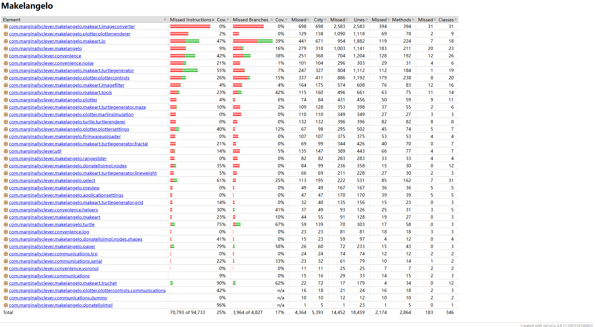

# Tâche 2 Rapport

******

Projet : [Makelangelo](https://github.com/umontreal-diro/Makelangelo-software)

Membres : Jiadong Jin 20150692 - Yuxiang Lin 20172116

Répertoire : [Lien](https://github.com/JdJ1n/Makelangelo-software) vers le répertoire.

Documentation : Suivante.

******

## Augmentation de la couverture de code total

Après les tests effectués avec config/coverage.py, la couverture totale est passée de 24,46% à 24,76%.
Voici deux captures d’écran montrant l’évolution de la couverture totale générée par Jacoco.

##### Avant
[Lien vers le rapport Jacoco.](https://html-preview.github.io/?url=https://github.com/JdJ1n/Makelangelo-software/blob/master/Document/htmlReportAvant/index.html)

##### Après
[Lien vers le rapport Jacoco.](https://html-preview.github.io/?url=https://github.com/JdJ1n/Makelangelo-software/blob/master/Document/htmlReportApres/index.html)

## Test 1-3

Ces trois tests sont destinés à `com.marginallyclever.convenience.helpers.MathHelper`. Nous avons directement ajouté ces trois tests dans le fichier existant `com.marginallyclever.convenience.helpers.MathHelperTest`. Après l’ajout de ces trois tests, la couverture de cette classe a considérablement augmenté.

##### Avant
!MathHelperAvant

##### Après
!MathHelperAprès

1. Test 1
   #### Emplacements
   Méthode testée : `UTF8JsonGenerator.java` ligne 149  
   Test : `UTF8GeneratorTest.java` ligne 58

2. Test 2
   #### Emplacements
   Méthode testée : `UTF8JsonGenerator.java` ligne 149  
   Test : `UTF8GeneratorTest.java` ligne 58

3. Test 3
   #### Emplacements
   Méthode testée : `UTF8JsonGenerator.java` ligne 149  
   Test : `UTF8GeneratorTest.java` ligne 58

## Test 4-6

Ces trois tests sont destinés à `com.marginallyclever.convenience.helpers.StringHelper`. Nous avons créé une nouvelle classe `com.marginallyclever.convenience.helpers.StringHelperTest` pour ajouter ces trois tests.
##### Avant

##### Après

1. Test 4
   #### Emplacements
   Méthode testée : `UTF8JsonGenerator.java` ligne 149  
   Test : `UTF8GeneratorTest.java` ligne 58

2. Test 5
   #### Emplacements
   Méthode testée : `UTF8JsonGenerator.java` ligne 149  
   Test : `UTF8GeneratorTest.java` ligne 58

3. Test 6
   #### Emplacements
   Méthode testée : `UTF8JsonGenerator.java` ligne 149  
   Test : `UTF8GeneratorTest.java` ligne 58

## Test 7-13

Ces sept tests sont destinés à `com.marginallyclever.convenience.ColorHSB`. Nous avons directement ajouté ces sept tests dans le fichier existant `com.marginallyclever.convenience.TestColorHSB`. Après l’ajout de ces sept tests, la couverture de cette classe a considérablement augmenté.

##### Avant

##### Après

1. Test 1
   #### Emplacements
   Méthode testée : `UTF8JsonGenerator.java` ligne 149  
   Test : `UTF8GeneratorTest.java` ligne 58

2. Test 2
   #### Emplacements
   Méthode testée : `UTF8JsonGenerator.java` ligne 149  
   Test : `UTF8GeneratorTest.java` ligne 58

3. Test 3
   #### Emplacements
   Méthode testée : `UTF8JsonGenerator.java` ligne 149  
   Test : `UTF8GeneratorTest.java` ligne 58

4. Test 3
   #### Emplacements
   Méthode testée : `UTF8JsonGenerator.java` ligne 149  
   Test : `UTF8GeneratorTest.java` ligne 58

5. Test 3
   #### Emplacements
   Méthode testée : `UTF8JsonGenerator.java` ligne 149  
   Test : `UTF8GeneratorTest.java` ligne 58

6. Test 3
   #### Emplacements
   Méthode testée : `UTF8JsonGenerator.java` ligne 149  
   Test : `UTF8GeneratorTest.java` ligne 58

7. Test 3
   #### Emplacements
   Méthode testée : `UTF8JsonGenerator.java` ligne 149  
   Test : `UTF8GeneratorTest.java` ligne 58