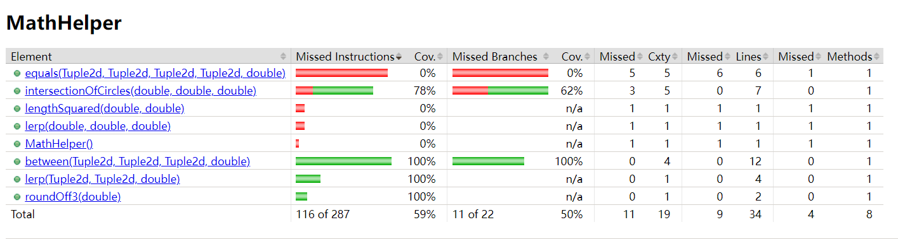
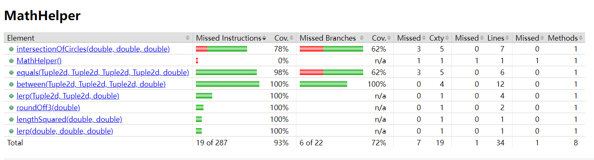
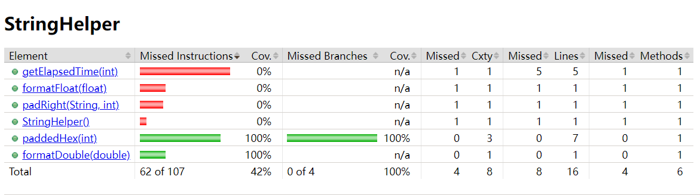
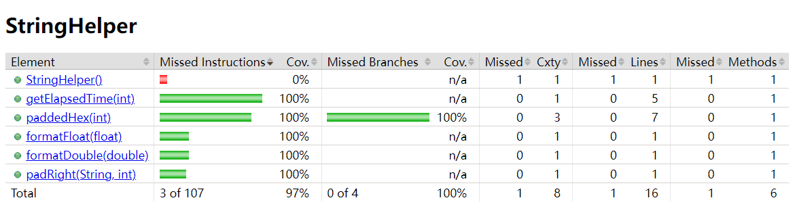
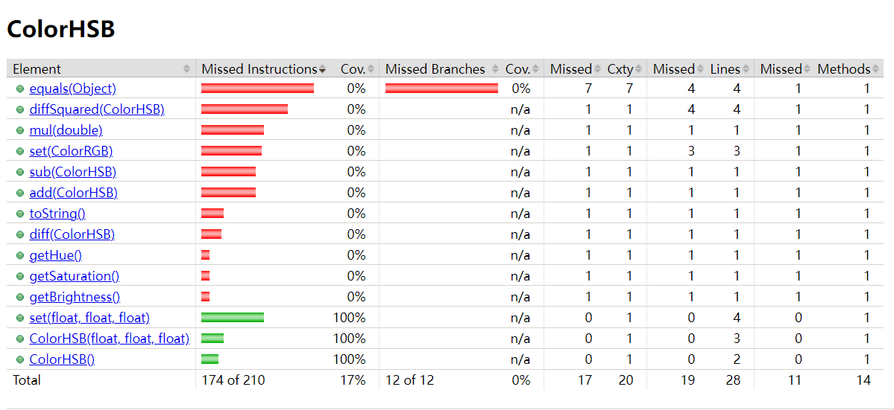
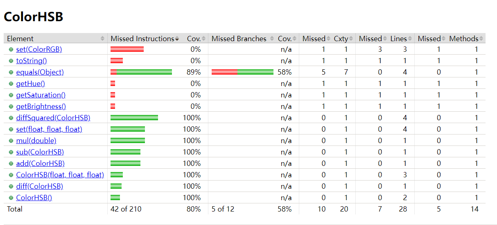

# Tâche 2 Rapport

******

Projet : [Makelangelo](https://github.com/umontreal-diro/Makelangelo-software)

Membres : Jiadong Jin 20150692 - Yuxiang Lin 20172116

Répertoire : [Lien](https://github.com/JdJ1n/Makelangelo-software) vers le répertoire.

Documentation : Suivante.

Bonus : Le test 2 utilise la bibliothèque [java-faker](https://github.com/DiUS/java-faker).

******

## Augmentation de la couverture de code total

Après les tests effectués avec config/coverage.py, la couverture totale est passée de 24,46% à 24,76%.
Voici deux captures d’écran montrant l’évolution de la couverture totale générée par Jacoco.

##### Avant

[Lien vers le rapport Jacoco.](https://html-preview.github.io/?url=https://github.com/JdJ1n/Makelangelo-software/blob/master/Document/htmlReportAvant/index.html)

##### Après

[Lien vers le rapport Jacoco.](https://html-preview.github.io/?url=https://github.com/JdJ1n/Makelangelo-software/blob/master/Document/htmlReportApres/index.html)

## Test 1-3

Ces trois tests sont destinés à `com.marginallyclever.convenience.helpers.MathHelper`. Nous avons directement ajouté ces
trois tests dans le fichier existant `com.marginallyclever.convenience.helpers.MathHelperTest`. Après l’ajout de ces
trois tests, la couverture de cette classe a considérablement augmenté.

##### Avant

##### Après

1. Test 1

   Destination : `public static double lengthSquared(double dx,double dy)`
   #### Emplacements
   Source : `MathHelper.java` ligne 26  
   Test : `MathHelperTest.java` ligne 96
   #### Intention
   Utiliser un test paramétré pour vérifier si les résultats calculés par cette méthode correspondent aux attentes, en
   utilisant plusieurs ensembles de données.

2. Test 2 * (On utilise java-faker ici.)

   Destination : `public static boolean equals(Tuple2d a0, Tuple2d a1, Tuple2d b0, Tuple2d b1, double epsilon)`
   #### Emplacements
   Source : `MathHelper.java` ligne 72  
   Test : `MathHelperTest.java` ligne 107
   #### Intention
   Utiliser la bibliothèque java-faker pour générer des nombres aléatoires conformes aux exigences, puis utiliser un
   fuzz test pour vérifier la fiabilité de cette méthode.

3. Test 3

   Destination : `public static Point2d lerp(Tuple2d a, Tuple2d b,double t)`
   #### Emplacements
   Source : `MathHelper.java` ligne 99  
   Test : `MathHelperTest.java` ligne 131
   #### Intention
   Utilisez un test paramétré pour vérifier si les résultats calculés par lerp correspondent aux attentes, en utilisant
   plusieurs ensembles de données.

## Test 4-6

Ces trois tests sont destinés à `com.marginallyclever.convenience.helpers.StringHelper`. Nous avons créé une nouvelle
classe `com.marginallyclever.convenience.helpers.StringHelperTest` pour ajouter ces trois tests.

##### Avant

##### Après

1. Test 4

   Destination : `public static String formatFloat(float arg0)`
   #### Emplacements
   Source : `StringHelper.java` ligne 17  
   Test : `StringHelperTest.java` ligne 10
   #### Intention
   Utiliser un test paramétré avec plusieurs ensembles de données pour vérifier si les résultats par cette méthode
   correspondent aux attentes.

2. Test 5

   Destination : `public static String padRight(String s, int n)`
   #### Emplacements
   Source : `StringHelperHelper.java` ligne 37  
   Test : `StringHelperTest.java` ligne 21
   #### Intention
   Utiliser un test paramétré avec plusieurs ensembles de données pour vérifier si les résultats par cette méthode
   correspondent aux attentes.

3. Test 6

   Destination : `public static String getElapsedTime(int seconds)`
   #### Emplacements
   Source : `StringHelperHelper.java` ligne 41  
   Test : `StringHelperHelperTest.java` ligne 32
   #### Intention
   Utiliser un test paramétré avec plusieurs ensembles de données pour vérifier si les résultats par cette méthode
   correspondent aux attentes.

## Test 7-13

Ces sept tests sont destinés à `com.marginallyclever.convenience.ColorHSB`. Nous avons directement ajouté ces sept tests
dans le fichier existant `com.marginallyclever.convenience.TestColorHSB`. Après l’ajout de ces sept tests, la couverture
de cette classe a considérablement augmenté.

##### Avant

##### Après

1. Test 7
   Destination : `public void set(float hue, float saturation, float brightness)`
   #### Emplacements
   Source : `ColorHSB.java` ligne 25  
   Test : `TestColorHSB.java` ligne 62

2. Test 8
   Destination : `public ColorHSB sub(ColorHSB x)`
   #### Emplacements
   Source : `ColorHSB.java` ligne 36
   Test : `TestColorHSB.java` ligne 73

3. Test 9
   Destination : `public ColorHSB add(ColorHSB x)`
   #### Emplacements
   Source : `ColorHSB.java` ligne 43  
   Test : `TestColorHSB.java` ligne 88

4. Test 10
   Destination : `public ColorHSB mul(double f)`
   #### Emplacements
   Source : `ColorHSB.java` ligne 50  
   Test : `TestColorHSB.java` ligne 103

5. Test 11
   Destination : `public float diffSquared(ColorHSB other)`
   #### Emplacements
   Source : `ColorHSB.java` ligne 57  
   Test : `TestColorHSB.java` ligne 117

6. Test 12
   Destination : `public float diff(ColorHSB other)`
   #### Emplacements
   Source : `ColorHSB.java` ligne 64  
   Test : `TestColorHSB.java` ligne 133

7. Test 13
   Destination : `public boolean equals(Object o)`
   #### Emplacements
   Source : `ColorHSB.java` ligne 85  
   Test : `TestColorHSB.java` ligne 149

#### Intention

Dans cette classe, nous avons effectué 4 tests supplémentaires, portant notre total de tests à 13. Étant donné que les 7
tests dans cette classe ont une structure similaire, nous utilisons des tests paramétrés avec plusieurs ensembles de
données pour vérifier ces méthodes et nous assurer qu'elles sont efficacement testées. Nous avons utilisé 4 méthodes
semblables, mais pas identiques (comme provideColorHSBValues(), etc.), un paramètre de tolérance delta = 1e-6f, une
méthode setUp et une méthode clamp pour uniformiser et simplifier ces 7 tests.